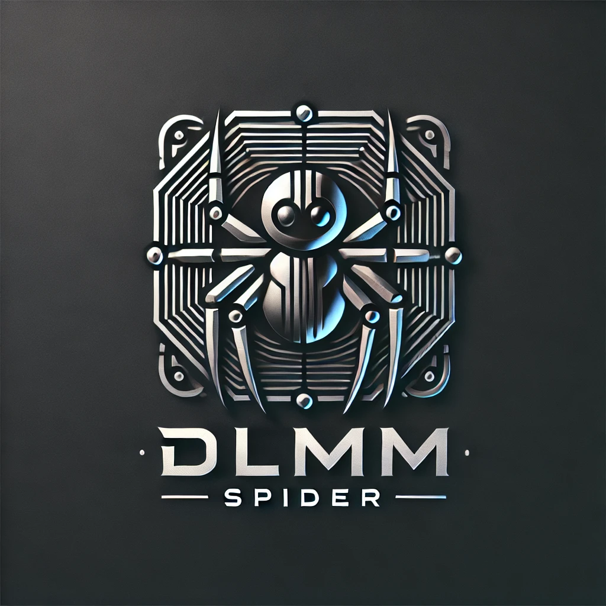
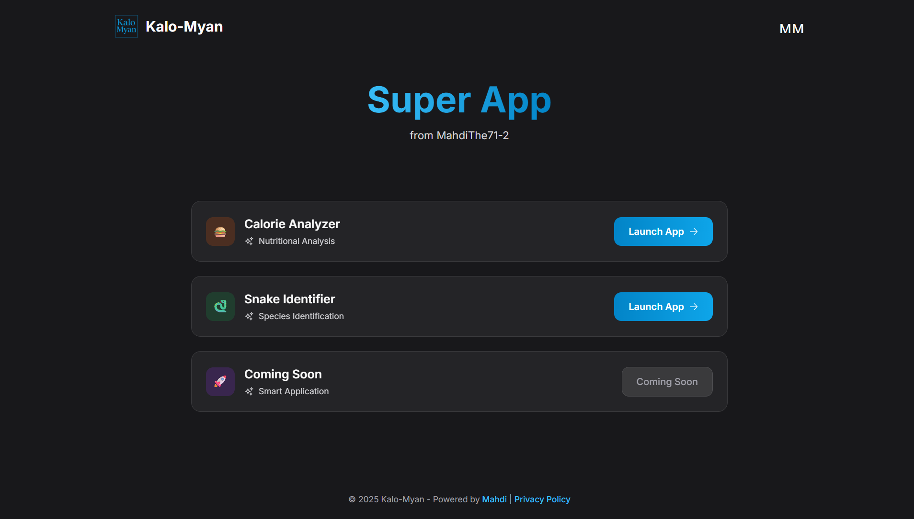
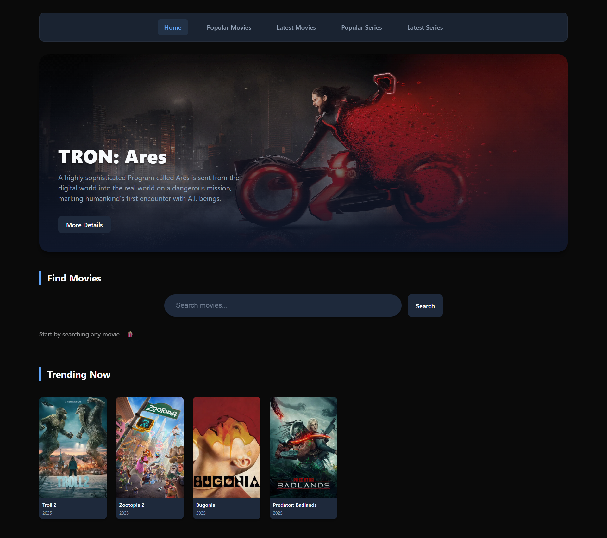

# Hey, I'm Mahdi (dopenclean)

 

---

## Currently Building

### **[WowFi](https://app.wowfi.xyz)** - AI-Stacked Info Aggregator

> **Cutting through the noise in crypto markets with institutional-grade analysis, free for everyone.**

I'm building **WowFi**, an AI-powered information aggregator that processes **billions of data points** from social media, blogs, and hard-to-reach sources to deliver cross-validated crypto insights. Using our proprietary **CVAS (Cross-Validation Analysis Stack)**, we turn market noise into actionable intelligence.

**The Problem:** Information asymmetry. Whales have curated feeds. Retail traders drown in noise, bots, and FUD.

**The Solution:** A 5-layer AI validation stack that:
- Processes billions of social posts, blogs & web sources
- Filters out 70%+ bot/spam content automatically  
- Cross-validates across **TVP** (Tiered Verification Pipeline) & **MRVF** (Multi-Reasoning Validation Framework)
- Delivers 70%+ confidence-scored insights on currencies & projects
- **100% Free** - Premium analysis for everyone

**Impact:** Leveling the playing field between institutional and retail crypto investors.

**[📖 Read the Docs](https://docs.wowfi.xyz/docs)** • **[🔗 Try WowFi](https://app.wowfi.xyz)** • **[💬 Join Discord](https://discord.gg/6uh25VJzyP)**

 

---

## Tech Stack & Expertise

---

## Featured Projects

### Web3 & Blockchain

#### **[DLMM Spider](https://github.com/dopenclean/dlmm_spider)** - Best Pool Selector for Meteora
> **AI-powered liquidity pool finder optimized for Meteora's DLMM**

A Python tool that identifies high-potential liquidity pools on Meteora's Dynamic Liquidity Market Maker by applying advanced filtering across multiple APIs.

**Key Features:**
- Multi-threaded data retrieval from Meteora API & DexScreener API
- Smart filtering: Liquidity ≤ $20K, Base Fee ≥ 2%, APR ≥ 50%, Bin Step ≥ 100
- 1-hour volume tracking (≥ $10K) for real-time opportunities
- Direct links to pools on Meteora & DexScreener

**Tech:** Python, APIs (Meteora, DexScreener), Multi-threading, Data Analysis

**Use Case:** Maximize returns for liquidity providers by finding low-liquidity, high-volume pools

---

#### **[9eyes Campaign Bot](https://github.com/dopenclean/9eyes_bot)** - Discord Automation for Web3
> **Intelligent Discord bot for real-time campaign updates**

An automated solution that fetches and shares campaign updates in Discord using GraphQL, featuring rich embeds and interactive elements.

**Key Features:**
- Automated real-time campaign fetching via GraphQL
- Rich media embeds with campaign images, descriptions, and dates
- Asynchronous performance with `aiohttp` and `asyncio`
- Image processing pipeline using Pillow
- Interactive buttons for quick campaign access
- Structured logging and error handling

**Tech:** Python, Discord.py, GraphQL, aiohttp, Pillow, asyncio

**Perfect for:** NFT projects, community engagement, promotional campaigns

---

### Web Applications

#### **[Kalo-Myan](https://kalo-myan.vercel.app)** - AI Health & Wildlife Assistant
> **Dual-purpose AI: Calorie counter + Snake identifier**

A Next.js application featuring two AI-powered utilities: camera-based calorie tracking and snake species identification.

**Features:**
- Real-time calorie counting from photos/camera
- Snake identification with safety information
- Modern, responsive UI
- Fast image processing

**Tech:** Next.js, React, AI/ML Models, Computer Vision, TypeScript

**Live Demo:** [kalo-myan.vercel.app](https://kalo-myan.vercel.app)

---

#### **[Movie Explorer](https://movie-explorer-nu-six.vercel.app)** - Modern Movie Tracker
> **Search, explore, and track movies with a sleek interface**

A feature-rich movie tracking application with search capabilities, detailed overviews, and personalized tracking.

**Features:**
- Comprehensive movie search
- Detailed movie information & ratings
- Personal tracking system
- Clean, modern UI/UX

**Tech:** Next.js, React, TypeScript, Movie API, Responsive Design

**Live Demo:** [movie-explorer-nu-six.vercel.app](https://movie-explorer-nu-six.vercel.app)

---

## What I'm About

**My Approach:**
- **Quality over quantity** - Every project solves a real problem
- **Open source advocate** - Sharing knowledge to elevate the community
- **AI enthusiast** - Leveraging ML/AI to build smarter solutions
- **Web3 believer** - Building the decentralized future

---

## Why WowFi Matters

> **The Problem:** In crypto, 70%+ of social data is bots or spam. Retail traders drown in noise while whales use curated feeds.

> **My Solution:** WowFi's CVAS processes billions of posts through 5 validation layers, delivering 70%+ confidence-scored insights—completely free.

**We're not just another aggregator.** We're leveling the playing field.

### WowFi by the Numbers

| Metric | Value |
|--------|-------|
| Data Sources | Social Media, Blogs, Web, Dark Corners |
| Bot Filtering | 70%+ removal rate |
| Confidence Score | 70%+ on all outputs |
| Cost to Users | **FREE** |
| Validation Layers | 5 (CVAS Architecture) |
| Update Frequency | Hourly/Daily Auto-Reload |

---

## Let's Connect

I'm always interested in collaborating on innovative projects, especially in **Web3**, **AI/ML**, and **full-stack development**.

---

### "Noise isn't unbeatable. It's exploitable."

**Building the future, one commit at a time.**

---

⭐ Star my repos if you find them useful! | Currently focused on WowFi

